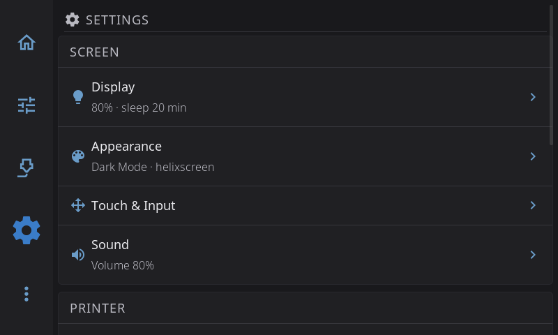

# Settings

Open Settings with the **Gear icon** in the navigation bar. The Settings screen is one list of twelve pages in three groups: the screen you're holding, the printer it drives, and HelixScreen itself. Every page is one tap from here.

Some rows show a short status line under their name, such as your brightness and sleep time, the Wi-Fi network you're on, or whether an update is waiting. The status is refreshed each time you come back to the Settings screen.

## Screen

| Page | What's in it |
|------|--------------|
| [Display](settings/display.md) | Screen rotation, UI scale, brightness, screen dim, display sleep, screensaver, sleep while printing |
| [Appearance](settings/appearance.md) | Dark mode, theme colors and the theme editor, animations, widget labels; printer visuals (toolhead style, G-code preview, Z movement, bed mesh render) |
| [Touch & Input](settings/touch-input.md) | Touch calibration, show touch points, scroll engage distance, long press time, home screen editing, scroll guard, scroll buttons, Android keyboard and navigation bar |
| [Sound](settings/sound.md) | Sounds on or off, volume, UI sounds, sound theme, output device, sound preview. Only shown when HelixScreen finds a speaker or buzzer |

## Printer

| Page | What's in it |
|------|--------------|
| [Printing](settings/printing.md) | Machine limits, motion, retraction, enclosure, material temperatures, cold load/unload, nozzle cooldown after filament changes, timelapse, macro buttons |
| [Devices](settings/devices.md) | Hardware health, camera, multi-filament system, fans, sensors, [LED settings](settings/led-settings.md), power devices, Spoolman (with label printer and barcode scanner) |
| [Safety & Alerts](settings/safety.md) | E-Stop confirmation, cancel escalation, macro confirmation, spaghetti detection, print completion alert, on-screen alerts |
| [Connection](settings/connection.md) | Network (Wi-Fi and Ethernet), your printers, the Moonraker host |

## HelixScreen

| Page | What's in it |
|------|--------------|
| [Language & Time](settings/language-time.md) | Language, timezone, 12 or 24-hour clock |
| [System](settings/system.md) | Screen lock PIN, performance, usage data, log level, restart, factory reset |
| [Updates](settings/updates.md) | Update channel, check for updates, install, or a note when your firmware handles updates |
| [Help & About](settings/help-about.md) | Welcome tour, debug bundles, Discord, documentation, About (version, system info, print hours) |

---

**Next:** [Advanced Features](advanced.md) | **Prev:** [Calibration & Tuning](calibration.md) | [Back to User Guide](../USER_GUIDE.md)
