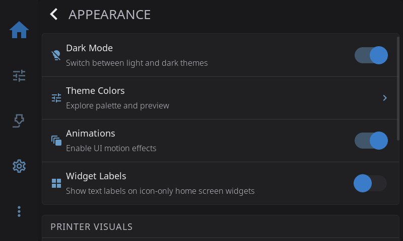

# Settings: Appearance

**Settings > Appearance** is about how HelixScreen looks: light or dark, which color theme, motion effects, and how your printer is drawn on screen.

---

## Dark Mode

Switch between light and dark themes. Disabled when the active theme doesn't support both modes.

---

## Theme Colors

Open the theme explorer to browse, preview, and apply color themes.

When you open **Theme Colors**, the theme explorer shows a **Theme Preset** dropdown, a live preview of sample cards, buttons, inputs, and status colors, and — for themes that ship both a light and a dark palette — a **Dark Mode** toggle. Pick a preset and tap **Apply** to switch to it.

### Built-in Themes

Eighteen themes ship in the box, listed alphabetically in the Theme Preset dropdown and previewed live as you scroll through them. Every theme has a dark palette; all but the four marked **dark only** also carry a matching light palette, so the Dark Mode toggle works with them.

| Theme | Character | Modes |
|-------|-----------|-------|
| **Ayu** | Warm gold accent with coral errors on slate surfaces | Light + dark |
| **Catppuccin** | Soft pastels, gentle lavender surfaces | Light + dark |
| **ChatGPT** | Understated greys with green/red status colours | Light + dark |
| **Cupertino** | Apple-style system colours on near-black | Light + dark |
| **Dracula** | Violet on deep slate with bright green highlights | Dark only |
| **Everforest** | Muted forest green and clay tones | Light + dark |
| **Gruvbox** | Warm retro earth tones — amber, olive, brick | Light + dark |
| **Hazard** | Safety-vest yellow, warning orange and danger red on powder-black, with sharp corners and brass seams | Dark only |
| **HelixScreen** | The default — the house palette, balanced blue on charcoal | Light + dark |
| **Kanagawa** | Soft wave-blue and gold on deep indigo | Light + dark |
| **Material Design** | Google-material blues and greens on grey | Light + dark |
| **Midnight** | Near-black navy, dim and low-glare | Dark only |
| **Nord** | Arctic blues and frost tones | Light + dark |
| **One Dark** | The Atom editor look — blue and green on charcoal | Light + dark |
| **Rose Pine** | Muted rose, iris and pine on soft charcoal | Light + dark |
| **Solarized** | The classic muted scheme — restrained accents on deep teal | Light + dark |
| **Tokyo Night** | City-at-night blues with pastel highlights | Light + dark |
| **Yami** | Vivid blue on deep grey, high contrast | Dark only |

Applying a theme takes effect immediately everywhere — no restart needed. The [theme editor](#editing-a-custom-theme) can recolor any of them, and **Save As New** keeps the original untouched.

### Editing a Custom Theme

Tap **Edit** in the theme explorer to open the theme editor, where you can recolor a palette and adjust its shape and shadow styling. Every change previews live on the surrounding UI as you make it.

The editor is organized into two sections:

**Theme Colors** — a grid of 16 color swatches, each labeled with what it controls (background, text, primary, success, warning, and so on). Tap any swatch to open a color picker with ready-made swatches and a custom color selection; pick a color and the swatch — and the live preview — update immediately.

**Style Properties** — four sliders that shape the overall look:

| Slider | What It Does |
|--------|--------------|
| **Border Radius** | Corner roundness, from square to fully rounded |
| **Border Width** | Default border thickness |
| **Border Opacity** | Border transparency (0 = invisible, 255 = solid) |
| **Shadow Intensity** | Drop shadow strength (0 = disabled) |

### Light and Dark Palettes

A theme can carry a separate palette for light mode and dark mode, and the editor works on **one at a time**. Choose which one you're editing *before* you tap **Edit**, using the **Dark Mode** toggle in the theme explorer: turn it on to edit the dark palette, off to edit the light palette. (The toggle only appears for themes that support both modes.) Saving keeps both palettes — the one you didn't touch this session is preserved.

> **Tip:** To give a theme a matching light and dark look, edit one palette and save, then flip the Dark Mode toggle, tap **Edit** again, and adjust the other.

### Saving Your Changes

Three buttons sit at the bottom of the editor:

| Button | What It Does |
|--------|--------------|
| **Reset** | For a built-in theme, restores the factory colors. For a theme you created, reverts to its last saved state. |
| **Save As New** | Creates a new named custom theme, leaving the original untouched. |
| **Save** | Overwrites the current theme with your changes. Stays disabled until you've made a change. |

Tapping **Save As New** opens a **Save Theme As** dialog. Enter a name (it suggests "<current theme> Copy") and tap **Save**, or **Cancel** to back out. Your new theme is saved, applied immediately, and appears in the Theme Preset dropdown.

Both **Save** and **Save As New** apply the theme live — no restart needed. If you try to leave the editor with unsaved changes, HelixScreen asks **"Discard Changes?"** first so you don't lose your work.

> **Note:** Custom and edited themes are stored on your printer under `~/helixscreen/config/themes/`. They survive updates and are yours to back up or copy between printers.

---

## Animations

Toggle UI motion effects (transitions, panel slides, confetti). Disable for better performance on slower hardware like Raspberry Pi 3.

---

## Widget Labels

Toggle labels on home panel widgets. Disable for a cleaner look on small screens.

---

## Printer Visuals

The rows under **PRINTER VISUALS** change how your printer and its data are drawn. None of them change what the printer does.

### Toolhead Style

Choose the toolhead icon shown on the Home Panel and Print Status screen. Options:

| Option | Description |
|--------|-------------|
| **Auto** (default) | HelixScreen detects your toolhead from the printer database or Klipper config |
| **Stealthburner** | Voron StealthBurner toolhead |
| **A4T** | Armored Turtle toolhead |
| **AntHead** | AntHead toolhead |
| **JabberWocky** | JabberWocky toolhead |

Most users can leave this on **Auto**. Change it if HelixScreen picks the wrong icon or if you've swapped to an aftermarket toolhead.

> **Note:** The native styles (**Default**, **Creality K1**, **Creality K2**) are auto-detected from your printer and don't appear as choices in the dropdown.

### G-code Preview

Choose how the G-code of the active print is visualized:

| Option | Description |
|--------|-------------|
| **Auto** (default) | HelixScreen picks the best mode for your hardware — interactive 3D on capable devices, falling back to lighter modes on slower ones |
| **3D View** | Interactive 3D rendering of the toolpath |
| **2D Layers** | Flat per-layer view — lighter on the GPU than 3D |
| **Thumbnail Only** | Shows just the slicer-embedded thumbnail, no live toolpath rendering — the lightest option |

Use a lighter mode if your hardware struggles with 3D rendering.

### Z Movement

Controls how Z-axis movement is displayed in the motion controls.

| Mode | Behavior |
|------|----------|
| **Auto** (default) | HelixScreen auto-detects based on your printer type (bed-slinger vs CoreXY vs delta) |
| **Bed Moves** | Z controls labeled as bed movement (bed goes down = nozzle moves up relative to bed) |
| **Nozzle Moves** | Z controls labeled as nozzle movement (nozzle goes up = away from bed) |

This only changes the direction labels in the UI — the actual G-code sent is the same. Use this if auto-detection picks the wrong style for your printer.

### Bed Mesh Render

Choose how bed mesh data is visualized: Auto, 3D View, or 2D Heatmap.

---

[Back to Settings](../settings.md) | [Prev: Display](display.md) | [Next: Touch & Input](touch-input.md)
