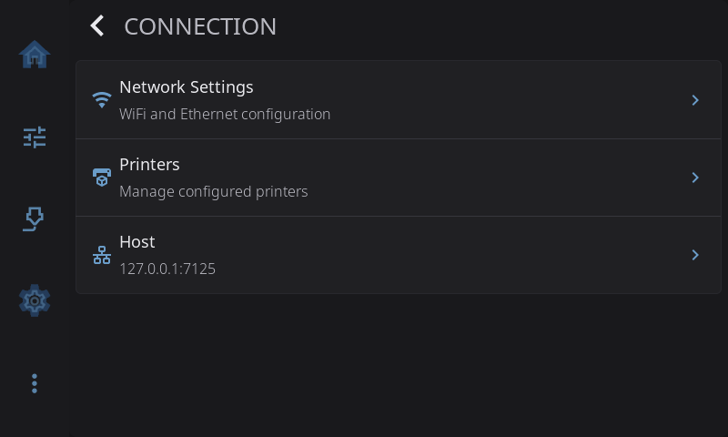

# Settings: Connection

**Settings > Connection** holds everything about how HelixScreen reaches the network and your printers. The row on the Settings screen shows how the screen is connected right now: the Wi-Fi network name, *Ethernet*, or *Not connected*.

---

## Network Settings

> Hidden on Android (the OS manages networking).

Tap to open the Network Settings overlay with a two-column layout:

**Left column — Status:**
- **WiFi** — Toggle on/off, view connection status (SSID, IP address, MAC address, signal strength). Shows a 2.4GHz indicator if your hardware only supports that band.
- **Ethernet** — View connection status (IP address, MAC address) — read-only, no toggle.
- **Test Network** — Verify internet connectivity. Disabled when no network is connected.

**Right column — Available Networks:**
- Scans and lists available WiFi networks with signal strength indicators
- Tap a network to connect (enter password if needed)
- **Add Hidden Network** — Connect to a network that doesn't broadcast its SSID
- **Refresh** button to re-scan (shows a spinner while scanning)

Joining a WiFi network while Ethernet is connected shows a warning that the wired network will be disconnected, then proceeds: some devices have a single network radio and cannot hold both at once (#1542). If a connection fails, the reason is shown with the result. A WiFi radio that an administrator has blocked (for example with `rfkill`) is left blocked: HelixScreen only clears a block on hardware where you have configured WiFi in HelixScreen (#1697).

---

## Printers

Manage all your configured printers. Tap to open the Printer Management overlay where you can:

- **Switch printers** — Tap any printer in the list to switch to it. HelixScreen disconnects from the current printer and connects to the new one.
- **Add a printer** — Tap "Add Printer" to launch the Setup Wizard for a new printer. You can cancel at any time to return to your current printer.
- **Delete a printer** — Tap the trash icon next to any non-active printer and confirm. You cannot delete the last remaining printer.

After switching, a toast notification confirms the new connection and you're taken to the Home panel.

---

## Host

Shows the current Moonraker host address (e.g., `localhost:7125`). Tap to open the **Change Host** dialog where you can enter a new IP address and port to connect to a different printer.

After changing the host, HelixScreen disconnects from the current printer and reconnects to the new one. Host names are looked up again on every reconnect, so a printer whose IP address changed (a router re-lease, for instance) is found again without restarting HelixScreen.

---

[Back to Settings](../settings.md) | [Prev: Safety & Alerts](safety.md) | [Next: Language & Time](language-time.md)
