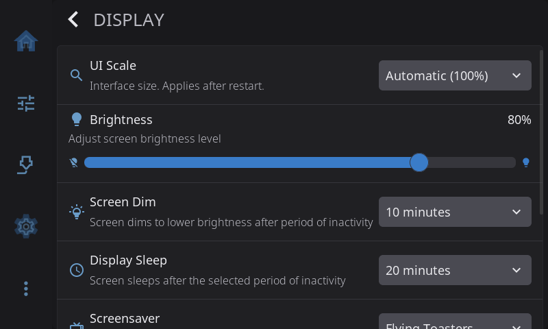

# Settings: Display

**Settings > Display** controls the screen itself: which way it faces, how big the interface is drawn, how bright it is, and when it dims, sleeps or shows a screensaver.



---

## Screen Rotation

Turn the picture to match how the panel is physically mounted: **Normal**, **90° Clockwise**, **180° Upside Down**, or **270° Clockwise**. The row sits at the top of the page, so someone facing a sideways screen reaches it without scrolling.

Changing the rotation applies the next time HelixScreen starts — when you pick a new value, HelixScreen offers to restart right away, and re-selecting the current rotation changes nothing. Touch input follows the new orientation automatically. The row is hidden on the desktop simulator, where you rotate the window from your operating system instead.

> If taps land in the wrong places after rotating, that is a touch-calibration question, not a rotation one — see the [Touch Calibration guide](../touch-calibration.md).

---

## UI Scale

How big the interface is drawn. The dropdown offers **Automatic**, then 100% through 200%.

**Automatic** works the size out from your panel's physical pixel density, so a screen that packs more pixels into the same number of millimetres gets a proportionally larger UI and everything stays the same real-world size. On every supported printer this comes out at 100%, so Automatic changes nothing there. It only grows the interface on very high-density displays — an Android phone or tablet, where the stock sizing would otherwise be uncomfortably tiny. Automatic shows you the figure it picked, e.g. *Automatic (158%)*.

Pick an explicit percentage if the result is not to your taste, or if HelixScreen has guessed wrong about a display it does not know. 100% pins the interface to its authored size whatever the panel reports.

**The new size appears after you restart HelixScreen.** Fonts and layout are worked out once, while the screen is being set up, so the change cannot be applied to a running interface. Nothing is lost by waiting — the setting is saved as soon as you pick it.

Your home panel arrangement is remembered per size: the number of widget slots changes with the scale, so each scale keeps its own saved layout. Rearrange at one size, switch, rearrange again; switching back restores the arrangement you made there.

---

## Brightness

Slider from 10–100%. Only shown on hardware with backlight control (hidden on Android).

On the Creality K2 the low end of the slider keeps the panel brighter than you ask for: the K2 panel shows anything under about 20% of its range as fully off, so HelixScreen never dims into that range.

---

## Screen Dim

When the screen dims to lower brightness: Never, 30s, 1m, 2m, 5m, or 10m of inactivity.

---

## Display Sleep

When the screen turns off completely: Never, 1m, 5m, 10m, 20m, or 30m of inactivity.

Sleeping turns the backlight off. On the rare panel with no adjustable backlight, the panel itself is powered down instead. If your screen stays faintly lit after sleep, or does not come back after waking, the behavior can be forced either way in `settings.json`:

```json
"display": { "panel_power_off": 1 }
```

Use `0` where `1` made things worse. Touch wakes the screen in all cases.

---

## Screensaver

Choose a screensaver to display during inactivity instead of dimming the screen:

| Option | Description |
|--------|-------------|
| **Off** | No screensaver; the screen dims and sleeps normally |
| **Flying Toasters** (default) | Classic flying toasters animation |
| **Starfield** | Scrolling starfield |
| **3D Pipes** | Animated 3D pipes |
| **Bouncing Printer** | Your printer drifts across the screen and bounces off the edges, changing color on every wall — with a celebration if it ever lands a corner |
| **Fireworks** | Fireworks bursting over hills under a night sky |

Each screensaver checks how much processor time it uses on your printer's screen. If it would slow the printer, it lowers its frame rate or detail, and if even that is too much it shows a black screen instead. It remembers the result and checks again after an update.

When any option other than **Off** is selected, a **Test Screensaver** button appears below the dropdown. Tap it to preview the selected screensaver immediately, without waiting for the inactivity timeout.

---

## Sleep While Printing

Allow the display to sleep during active prints. Off by default so you can monitor progress.

> **Tip:** Touch the screen to wake from sleep.

---

[Back to Settings](../settings.md) | [Next: Appearance](appearance.md)
