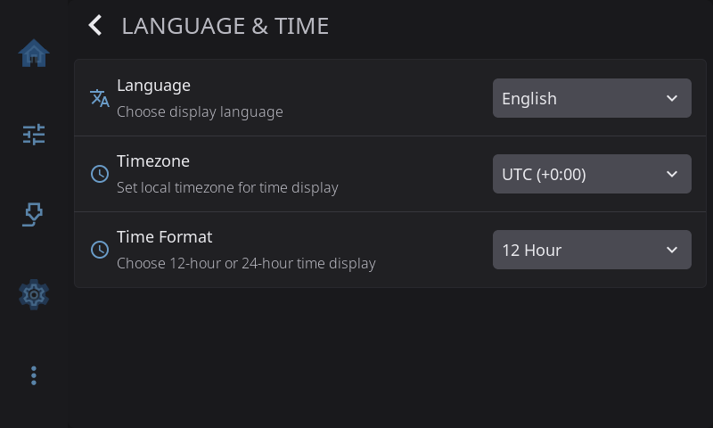

# Settings: Language & Time

**Settings > Language & Time** sets the language HelixScreen speaks and how it shows the time. The row on the Settings screen shows your current choice, for example *English · 24-hour*.

---

## Language

Choose the display language for all UI text. Nine languages are available: English, German, Spanish, French, Italian, Japanese, Portuguese, Russian, and Chinese.

---

## Timezone

Set your local timezone so that print completion times, ETAs, and the clock widget display the correct time. Most printers default to UTC. Select from a curated list of common timezones. Each entry shows its UTC offset (e.g., "Eastern (-5:00)"). Daylight saving time is handled automatically using your system's timezone database.

---

## Time Format

Choose between 12-hour and 24-hour clock display. Affects all timestamps shown throughout the UI.

---

[Back to Settings](../settings.md) | [Prev: Connection](connection.md) | [Next: System](system.md)
