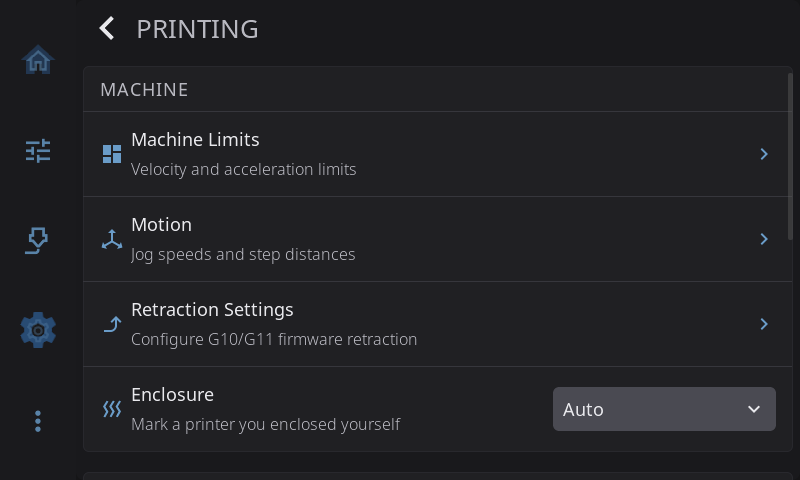

# Settings: Printing

**Settings > Printing** holds settings that change how the printer moves, heats and handles filament. The page has three sections:

- **MACHINE**: Machine Limits, Motion, Retraction Settings and Enclosure
- **FILAMENT**: Material Temperatures, Allow cold load/unload and Cool nozzle after filament ops
- **EXTRAS**: Timelapse and Macro Buttons

How the printer is *drawn* (toolhead icon, G-code preview, Z direction labels, bed mesh view) lives in [Appearance](appearance.md#printer-visuals).



---

## Machine Limits

Tap to open the Machine Limits overlay. A banner at the top reminds you: **"Changes are temporary and reset on printer reboot."** These sliders override your Klipper config for the current session — useful for testing or troubleshooting motion issues. To make permanent changes, edit `printer.cfg` directly.

Each setting has a slider, with the current value shown on the right in a tappable field:

> **Tap the value to type an exact number.** Sliders are quick but coarse — Max Acceleration spans 500–50000 over a few hundred pixels, so landing on exactly 3000 by dragging is luck. Tapping the value opens a numeric keypad where you type the number you actually want.

| Setting | Range | Description |
|---------|-------|-------------|
| **Max Velocity** | 50–1000 mm/s | Maximum toolhead speed |
| **Max Acceleration** | 500–50000 mm/s² | Maximum acceleration |
| **Accel to Decel** | 500–50000 mm/s² | Acceleration-to-deceleration limit (caps how aggressively moves slow down) |
| **Square Corner Velocity** | 1.0–20.0 mm/s | Maximum speed carried through square corners. Accepts half steps (5.5) — type them on the keypad. |
| **Extrude Speed** | 1–50 mm/s | Feedrate used for manual extrude/retract actions |

> **Extrude Speed is saved.** Unlike the motion limits above, the Extrude Speed value is a persisted HelixScreen setting — it is remembered across restarts and applies to the manual extrude/retract controls.

Below the adjustable sliders is a read-only **Config-defined** section showing your **Max Z Velocity** and **Max Z Accel**, which come from your Klipper config and cannot be changed here.

**Reset:** the **Reset** button at the bottom restores the motion limits to your printer's original configured values.

---

## Motion

Jog speeds and the per-mode move distances for the jog pad. See [Motion](../motion.md#motion-settings) for what each setting does.

---

## Retraction Settings

> Only shown when firmware retraction (`[firmware_retraction]`) is configured in Klipper.

Tap to open the retraction overlay. Configure G10/G11 firmware retraction parameters. **Changes apply immediately** and can be adjusted mid-print for tuning.

As on Machine Limits, each value is shown in a tappable field — **tap it to type an exact number** on the numeric keypad instead of hunting for it with the slider. The distances accept two decimals (0.85 mm).

| Parameter | Range | Description |
|-----------|-------|-------------|
| **Enable Retraction** | On/Off | Master toggle for firmware retraction |
| **Retract Length** | 0.00–6.00 mm | Amount of filament to retract. 0.4–2 mm for direct drive, 4–6 mm for bowden. |
| **Retract Speed** | 10–80 mm/s | Speed of the retraction movement |
| **Unretract Extra** | 0.00–1.00 mm | Extra filament to prime after retraction to compensate for ooze |
| **Unretract Speed** | 10–60 mm/s | Speed of the prime (unretract) movement |

---

## Enclosure

Tells HelixScreen whether your printer is enclosed. **Auto** (the default) goes by what HelixScreen knows about your printer model. Set it to **Enclosed** if you enclosed an open-frame printer yourself, or **Open frame** if HelixScreen thinks your printer is enclosed and it isn't. [Drying filament on the bed](../temperature.md#drying-filament-on-the-bed) is only offered on a printer that counts as enclosed.

---

## Material Temperatures

Configure preheat presets for different filament materials (PLA, PETG, ABS, TPU, etc.). Each material can have:

- **Nozzle Temperature** - Target extruder temperature. The field clamps to the range your printer and nozzle allow, so it cannot be set past what the hardware supports.
- **Bed Temperature** — Target bed temperature
- **Preheat Macro** — A Klipper macro to run when preheating this material
- **Macro Handles Heating** — If enabled, the macro is responsible for setting temperatures. If disabled, HelixScreen sets temperatures first, then runs the macro as an additional step.

### Editing materials and brands by hand

Everything on this screen and in the filament catalog (the brand and material picker) can also be edited in one file, `user_filaments.json`. On most installs it lives in `~/printer_data/config/helixscreen/`, so Mainsail or Fluidd can open it from their config file browser. The copy in the install folder's `config/` directory (for example `~/helixscreen/config/`) is a link to the same file.

The file has two lists: `types` for material types (PLA, PETG and so on) and `filaments` for branded products.

```json
{
  "types": [
    {"name": "PLA", "nozzle_min": 205, "nozzle_max": 225, "bed": 65},
    {"name": "ABS", "chamber": 50, "preheat_macro": "PREHEAT_ABS", "macro_handles_heating": true},
    {"name": "PEKK", "nozzle_min": 330, "nozzle_max": 360, "bed": 120, "chamber": 80}
  ],
  "filaments": [
    {"id": "mybrand-pla-basic", "brand": "MyBrand", "name": "PLA Basic", "type": "PLA",
     "nozzle": 215, "nozzle_min": 200, "nozzle_max": 230, "bed": 60}
  ]
}
```

**Material types (`types`).** An entry whose `name` matches a built-in material changes only the fields you list; everything else keeps the built-in value. The Material Temperatures screen writes here too, so a change you make on the screen shows up in this file and the other way round. An entry with a new `name` adds a material type, which then appears in the Material Temperatures list and can be used as a product's `type`.

- Fields: `nozzle_min`, `nozzle_max`, `bed`, `chamber` (0 means no chamber heat), `preheat_macro`, `macro_handles_heating`, `dry_temp`, `dry_time` (minutes), `density` (g/cm³), `category` and `compat_group`.
- Numbers must be written as plain numbers: `205`, not `"205"`. A field whose value is text or `null` is ignored with a warning in the log, and the built-in value stays.
- A new type must set `nozzle_min` and `nozzle_max`, with `nozzle_max` at least `nozzle_min`; a type without a usable nozzle range is skipped with a warning in the log. Set `bed` too; anything else it leaves out is 0. Its `compat_group` defaults to its own name, so endless spool never swaps it with a different material. Set `compat_group` to an existing group (for example `"PLA"`) if it really is interchangeable with that group.
- The built-in list is the `types` section of `assets/filaments.json` in the HelixScreen install folder. Read it for names and default values, but don't edit it, because updates replace it.
- **Reset to Default** on the Material Temperatures screen removes your temperature and macro fields for a built-in type. A type you added has no default, so the button is hidden for it.

**Brands and products (`filaments`).**

- `id`, `brand`, `name` and `type` are required. The `id` must be unique; lowercase with dashes is the convention.
- `nozzle`, `nozzle_min`, `nozzle_max`, `bed` and `density` are optional. Anything you leave out comes from the product's material type, including your changes in `types`.
- To change a built-in product, use its `id` and include only the fields you want to change. Built-in products are in the `filaments` section of `assets/filaments.json`.
- Temperatures set on a product win over its type's values.

Restart HelixScreen after editing so every screen picks up the change. A file that is only a list of products (`[ ... ]`) still works; HelixScreen rewrites it in the form above the next time it saves. If the file stops parsing, HelixScreen ignores it until it's fixed, and the next save from the screen (a product or a Material Temperatures change) copies it to `user_filaments.json.bak` before starting fresh.

Before this file was linked into `printer_data`, it lived only in the install folder, where an update from Mainsail or Fluidd deletes it. If you added products on an older version, copy the file somewhere safe before updating.

**Material temperatures from older versions.** Older versions kept Material Temperatures changes in `settings.json` under `material_overrides`. HelixScreen moves them into `types` in `user_filaments.json` the first time it starts, and removes them from `settings.json`. If `user_filaments.json` doesn't parse at that point, they stay in `settings.json` and the move is tried again on the next start. Going back to an older version loses them, because older versions only look in `settings.json`. Which material each preset button uses stays in `settings.json` under `preset_materials`, a list of four entries such as `{"type": "PETG"}`; stop HelixScreen before editing `settings.json`, because it rewrites the whole file whenever it saves a setting.

---

## Allow cold load/unload

| State | Behavior |
|-------|----------|
| **Off** (default) | Filament load/unload is blocked when the nozzle is below the minimum extrude temperature |
| **On** | Load/unload run on a cold nozzle, and HelixScreen never heats it for you first |

By default, HelixScreen won't run a filament load or unload while the nozzle is too cold to extrude, matching Klipper's cold-extrude safety check. Turn this on if your load/unload macros heat the nozzle themselves before extruding, so the operation isn't blocked before your macro gets a chance to warm up.

With it on, HelixScreen also stops running its own preheat before the operation — your macro is dispatched immediately and owns the temperature from there. This applies wherever you start a load or unload, including the Filament panel and the filament system's own panel.

You don't need this for a printer whose stock macros HelixScreen already recognizes as self-heating (QIDI's `M604` / `M603`, for instance), or for a filament system whose firmware heats as part of loading (AFC, CFS, QIDI Box, AD5X IFS). Those are detected, and the preheat is skipped for them whatever this setting says.

---

## Cool nozzle after filament ops

| State | Behavior |
|-------|----------|
| **On** (default) | The extruder heater is turned off a couple of minutes after a load or unload finishes |
| **Off** | The nozzle stays at whatever temperature the operation left it |

A filament change heats the nozzle to material temperature. Left alone, it would sit there indefinitely — burning power and slowly cooking the filament in the melt zone. So HelixScreen turns the heater off once you're done. The delay (two minutes by default) is there so you can run several loads and unloads back to back without the nozzle cooling between them; each new operation restarts the clock. Nothing happens while a print is running — an active job manages its own heat.

**Turn this off if your filament system already does it.** [AFC](../filament.md) has its own post-operation cooldown, and other multi-material firmware is adding the same. Two independent timers driving one heater is confusing at best. Leave whichever one you prefer in charge, and switch the other off.

The setting is per printer, so an AFC machine can opt out while your other printers keep the built-in behavior. To change the two-minute delay, see [`cooldown_delay_seconds`](../../CONFIGURATION.md#cooldown_delay_seconds).

---

## Timelapse

> Only shown when the [Moonraker-Timelapse](https://github.com/mainsail-crew/moonraker-timelapse) plugin is installed.

Tap to open the Timelapse Settings overlay. Configure how HelixScreen records timelapse videos of your prints.

| Setting | Options | Description |
|---------|---------|-------------|
| **Enable Timelapse** | On/Off | Master toggle for timelapse recording |
| **Recording Mode** | Layer / Hyperlapse | **Layer** captures one frame at each layer change — best for most prints. **Hyperlapse** captures frames at fixed time intervals — better for very long prints. |
| **Framerate** | 15 / 24 / 30 / 60 fps | Playback speed of the rendered video. 30 fps is the default. |
| **Auto-render video** | On/Off | When enabled, automatically renders a video file when the print completes |

A quick **timelapse toggle** also appears on the print status panel, so you can enable or disable recording without leaving the print view.

Changes are saved immediately and sent to Moonraker. If the timelapse plugin is not yet installed, HelixScreen shows an **Install Wizard** that walks you through the SSH commands to set it up — see [Advanced > Timelapse](../advanced.md#timelapse) for details.

For browsing and playing recorded videos, see **Advanced > Timelapse Videos** (covered in [Advanced > Timelapse](../advanced.md#timelapse)).

---

## Macro Buttons

Tap to open the Macro Buttons overlay. Configure quick-action buttons and standard macro assignments.

### Quick Buttons

These macros power the buttons you see on the Controls and Filament panels:

| Button | Where it appears | What it does by default |
|--------|-----------------|------------------------|
| **Cooldown** | Preheat widget (when heaters are on), Filament panel (always shown, dimmed while the nozzle isn't heating) | Turns off extruder and bed heaters |
| **Load Filament** | Filament panel | Runs `LOAD_FILAMENT` |
| **Unload Filament** | Filament panel | Runs `UNLOAD_FILAMENT` |
| **Custom Macro 1** | Controls panel | Runs `HELIX_CLEAN_NOZZLE` (label: "Clean Nozzle") |
| **Custom Macro 2** | Controls panel | Runs `HELIX_BED_LEVEL_IF_NEEDED` (label: "Bed Level") |

**Cooldown behavior:** When you preheat a material using the Preheat widget on the home or controls panel, the button automatically switches to **Cool Down** while any heater target is above zero. Tapping it runs your configured cooldown macro. This is especially useful if your cooldown needs to do more than just turn off heaters — for example, turning off chamber heaters, bed fans, or recirculation fans.

You can customize any of these. Each button has a **label** (what the button says) and **G-code** (what it runs when tapped). The cooldown macro can be a simple G-code string or a multi-line sequence:

```
SET_HEATER_TEMPERATURE HEATER=extruder TARGET=0
SET_HEATER_TEMPERATURE HEATER=heater_bed TARGET=0
SET_FAN_SPEED FAN=bed_fan SPEED=0
```

For advanced configuration via `settings.json`, see the [default_macros reference](../../CONFIGURATION.md#default_macros).

### Standard Macros

HelixScreen auto-detects common macros from your Klipper configuration (e.g., it recognizes `CLEAN_NOZZLE`, `NOZZLE_CLEAN`, and similar naming patterns). You can override any auto-detected assignment:

| Slot | What it controls | Common auto-detected macros |
|------|------------------|-----------------------------|
| **Load Filament** | Filament load operations | LOAD_FILAMENT, M701 |
| **Unload Filament** | Filament unload operations | UNLOAD_FILAMENT, M702 |
| **Purge** | Nozzle purge/prime | PURGE, PURGE_LINE, LINE_PURGE, PRIME_LINE |
| **Pause** | Print pause | PAUSE, M600 |
| **Resume** | Print resume | RESUME |
| **Cancel** | Print cancel | CANCEL_PRINT |
| **Bed Mesh** | Bed mesh calibration | BED_MESH_CALIBRATE |
| **Bed Level** | Manual bed leveling | BED_SCREWS_ADJUST, SCREWS_TILT_CALCULATE |
| **Clean Nozzle** | Nozzle cleaning | CLEAN_NOZZLE, NOZZLE_CLEAN |
| **Heat Soak** | Chamber heat soak | HEAT_SOAK |
| **Park** | Parking the toolhead (Motion screen, Move tab) | PARK, PARK_TOOLHEAD, TOOLHEAD_PARK |

If your printer doesn't have a matching macro, some slots fall back to HelixScreen helper macros (installed via **Advanced > Install Helper Macros**). Leave a slot empty to disable that function.

**Load Filament and Unload Filament on a multi-filament printer:** left on **(Auto)**, these two drive your filament system directly rather than running a macro. Choose a macro yourself and it takes over — your macro runs and the filament system's own handling is skipped for that operation, so anything it would have done becomes your macro's job. Set the slot back to **(Auto)** to hand the operation back. The other slots are unaffected. See [Customizing which macro runs](../filament.md#customizing-which-macro-runs).

> **Looking for Load/Unload/Purge button customization?** See the [Filament guide](../filament.md#customizing-which-macro-runs) for a step-by-step walkthrough, including how these buttons interact with AMS systems.

### Per-Material Preheat Macros

You can also assign a custom Klipper macro to each material preset (PLA, PETG, ABS, TPU). This is useful when preheating requires more than just setting temperatures — for example, turning on bed fans for ABS or starting a chamber heater.

Configure per-material macros in **Material Temperatures** (above). Each material can have:

- **Preheat Macro** — A Klipper macro to run when preheating this material
- **Macro Handles Heating** — If enabled, the macro is responsible for setting temperatures. If disabled, HelixScreen sets temperatures first, then runs the macro as an additional step.

These settings apply to the **Preheat widget** on Home or Controls and to the **material preset buttons on the Filament panel**, including the active-spool preset when shown. Long-pressing a Filament preset changes the material assigned to that button; tapping it preheats that material. Individual nozzle, bed, and chamber temperature controls do not run a whole-material macro.

**Macro Handles Heating** is not an enable/disable switch for the macro: the assigned macro runs in either mode. With it enabled, the macro must set every temperature you want. With no macro assigned, or one this printer does not define, the button applies its displayed preset temperatures. Manual preheat does not keep a hotter previous nozzle target for purging; load/unload operations retain their own heating behavior.

---

[Back to Settings](../settings.md) | [Prev: Sound](sound.md) | [Next: Devices](devices.md)
