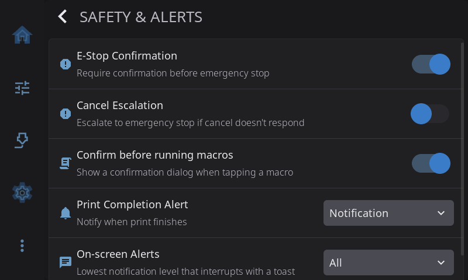

# Settings: Safety & Alerts

**Settings > Safety & Alerts** covers emergency controls, confirmations, failure detection and how HelixScreen tells you about finished prints.

---

## E-Stop Confirmation

| State | Behavior |
|-------|----------|
| **Off** (default) | Tapping E-Stop fires immediately — fastest emergency response |
| **On** | Shows a confirmation dialog requiring a tap-and-hold before triggering |

Enable this if you find yourself accidentally hitting the E-Stop button. Disable it if you need the fastest possible emergency response.

---

## Cancel Escalation

When a print cancel is sent, some printers take a long time to finish their cancel routine (parking tools, cooling down, running CANCEL_PRINT macros). Cancel Escalation adds a safety net: if the cancel doesn't complete within a timeout, HelixScreen automatically escalates to an emergency stop (M112).

| Setting | Options |
|---------|---------|
| **Cancel Escalation** | On/Off toggle. **Off by default.** |
| **Escalation Timeout** | 15, 30, 60, or 120 seconds. Only shown when escalation is enabled. Default: 30 seconds. |

**When to leave this off:**
- Toolchangers that need to park tools during cancel
- Printers with long CANCEL_PRINT macros
- Any printer where the cancel routine is expected to take more than a few seconds

**When to turn this on:**
- Simple printers where cancel should complete quickly
- If you've experienced "stuck" cancels where the printer never returns to idle

---

## Confirm before running macros

| State | Behavior |
|-------|----------|
| **Off** (default) | Tapping a macro button runs it immediately |
| **On** | Shows a confirmation dialog before running any macro |

Enable this if you have macros that move the toolhead, heat the printer, or perform other actions you don't want triggered by an accidental tap.

---

## Spaghetti Detection

Only present on printers with built-in AI failure detection (a K2 Plus, or a Snapmaker U1 with defect detection). While a print is running, HelixScreen watches the camera for spaghetti - a print that has detached or is piling up as a nest of plastic.

| State | Behavior |
|-------|----------|
| **On** (default) | During a print, the camera is checked for failures |
| **Off** | Nothing is watched; no detection alerts appear |

The first time HelixScreen starts on a printer that had its own detection choice stored (a K2 Plus), your existing on/off and pause settings are carried over once. After that they live here.

### Pause on Detection

| State | Behavior |
|-------|----------|
| **On** (default) | A detected failure pauses the print and shows the spaghetti dialog, so you can resume, abort, or turn detection off |
| **Off** | A detected failure only shows a warning; the print keeps running |

This row is only adjustable while Spaghetti Detection is on. On printers whose firmware pauses the print itself when it detects a failure (the U1), the pause happens either way - this setting controls whether HelixScreen adds its own pause on printers where it must, and whether you get the full dialog or just the warning.

---

## Print Completion Alert

Controls how HelixScreen notifies you when a print finishes, is cancelled, or fails — when you're not already on the print status screen.

| Mode | Behavior |
|------|----------|
| **Off** | No visual notification (sound still plays if enabled) |
| **Notification** | Brief toast message at the top of the screen |
| **Alert** (default) | Full-screen modal showing print stats — duration, layers, filament used — with confetti for successful prints |

To change: **Settings > Safety & Alerts > Print Completion Alert** dropdown.

> **Note:** Print errors always show the full alert modal regardless of this setting, since errors need immediate visibility. If you're already on the print status screen when a print ends, no notification is shown (the panel itself shows the result).

Sound always plays for terminal print states (complete, cancelled, error) regardless of alert mode, as long as the master Sounds toggle is on.

---

## On-screen Alerts

Toasts are the brief banners that slide in at the top of the screen — "Filament loaded", "Saved", "Update available". If the informational ones feel chatty, **Settings > Safety & Alerts > On-screen Alerts** sets the lowest level that is allowed to interrupt you:

| Level | What still toasts |
|-------|-------------------|
| **All** (default) | Everything — info, success, warnings and errors |
| **Warnings & errors** | Info and success messages are held back |
| **Errors only** | Only error toasts appear |

Held-back notifications are not lost — they still land in the notification history (open it from the Notifications widget on the Home panel). The filter never silences a full-screen error dialog, and it never silences the [Print Completion Alert](#print-completion-alert) above; both bypass it on purpose.

---

[Back to Settings](../settings.md) | [Prev: Devices](devices.md) | [Next: Connection](connection.md)
