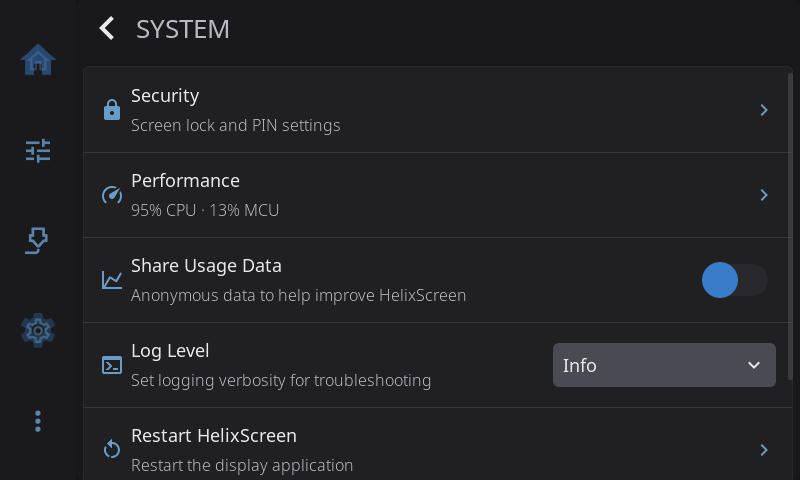

# Settings: System

**Settings > System** covers the screen lock, usage data, logging and maintenance actions. Network and printer connection settings live in [Connection](connection.md), and touch settings in [Touch & Input](touch-input.md).

---

## Security

Set up a screen lock with a PIN code to prevent unauthorized access to your printer controls. Tap to open the Security overlay.

**When no PIN is set:**

- **Set PIN** — Create a 4–6 digit numeric PIN. You'll be asked to enter it twice to confirm.

**When a PIN is set:**

- **Change PIN** — Update your PIN. You must enter the current PIN first, then enter and confirm the new one.
- **Remove PIN** — Disable the PIN entirely. Requires entering the current PIN for confirmation.
- **Auto-lock** — Toggle automatic screen locking. When enabled, the screen locks after the display sleep timeout. You'll need to enter your PIN to unlock.

When the screen is locked, a full-screen lock overlay appears with a numeric keypad. Enter your PIN and tap the checkmark to unlock. If you enter the wrong PIN, an error message appears briefly. An **Emergency Stop** button remains accessible in the top-right corner of the lock screen while a print is running, so you can always halt the printer in an emergency without unlocking.

The PIN is stored securely as a one-way hash in your settings — the actual digits are never saved in plain text. A factory reset clears all security settings.

---

## Performance

> Only shown when performance data is available.

The row description shows a live summary of host load. Tap to open the Performance overlay, which shows real-time host CPU and memory usage along with per-MCU load for each connected controller board. Useful for spotting an overloaded host or a struggling MCU when prints stutter or the UI feels sluggish.

---

## Share Usage Data (Telemetry)

Toggle anonymous usage telemetry that helps improve HelixScreen. Data collection is completely anonymous — no personal information, printer names, or file names are ever sent.

When enabled, a **View Telemetry Data** row appears below the toggle. Tap it to see exactly what data will be sent. See the [Telemetry & Privacy](../../TELEMETRY.md) documentation for full details on what is and isn't collected.

---

## Log Level

Control how much detail HelixScreen writes to its logs. This is useful when troubleshooting issues or gathering diagnostic information for a bug report.

| Level | What it captures |
|-------|-----------------|
| **Warn** | Errors and warnings only (quiet) |
| **Info** | Connection events, panel changes, milestones (default) |
| **Debug** | State changes, API calls, component init (use this for bug reports) |
| **Trace** | Everything including LVGL internals (very verbose, rarely needed) |

Changes take effect immediately, with no restart required. Set to **Debug** before reproducing a problem, then set back to **Info** when done.

> **Tip:** Debug and Trace levels increase CPU usage and log volume. Don't leave them enabled long-term.

---

## Restart HelixScreen

Restart the display application. Useful after changing settings that require a restart (like theme changes) or if the UI becomes unresponsive. Shows a brief "Restarting..." toast before the app restarts.

---

## Factory Reset

Clears **all** HelixScreen settings and restarts the Setup Wizard. This resets:

- All appearance, display, and sound settings
- LED configuration
- Printer connection details
- Sensor roles and hardware expectations
- All other preferences

**Does not affect** your Klipper configuration, Moonraker, or any files on the printer itself.

---

[Back to Settings](../settings.md) | [Prev: Language & Time](language-time.md) | [Next: Updates](updates.md)
