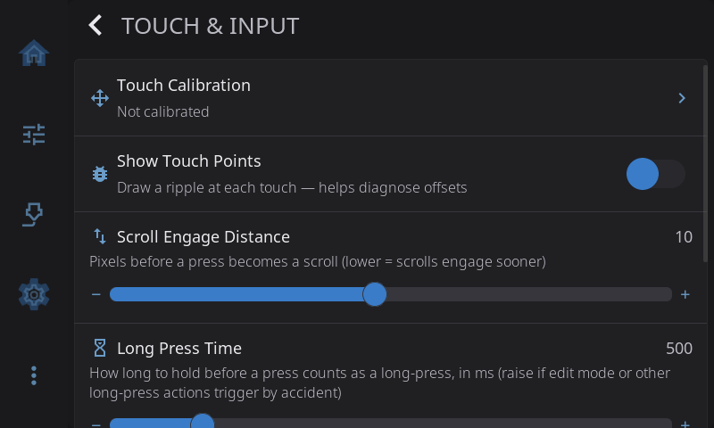

# Settings: Touch & Input

**Settings > Touch & Input** groups every setting that affects how the screen reads your finger: calibration, debug visualization, scroll feel, long-press behavior, scroll buttons, and on Android the keyboard and navigation bar.

---

## Touch Calibration

Recalibrate if taps register in the wrong location:

1. Tap **Touch Calibration**
2. Tap each crosshair target as it appears on screen (3 points, 7 taps each)
3. Test that taps land correctly in the verify area
4. Tap **Accept** to save (or **Retry** to redo)

The row description shows "Calibrated" or "Not calibrated" status. Always available — you can recalibrate even on screens that auto-detect as already correct. For the full menu of force-calibration options (env var, config file, CLI) and per-platform paths, see the [Touch Calibration Guide](../touch-calibration.md).

---

## Show Touch Points

Toggles a debug overlay that draws a ripple at every touch point. Useful when taps feel offset or buttons aren't responding where you expect — turn it on, tap around, and see exactly where the system thinks your finger is. Turn off when done.

Takes effect immediately — no restart required.

> Persistent equivalent: `HELIX_DEBUG_TOUCH=1` in `helixscreen.env`. The Settings toggle and the env var read the same flag.

---

## Scroll Engage Distance

Pixels of finger travel before a press becomes a scroll instead of a click. Range `1`–`20`, default `10`.

| Symptom | Suggested value |
|---|---|
| Scrolls fire a click on whatever was under your finger when you meant to scroll | **5** |
| Default — sweet spot for most panels | **10** |
| Taps feel twitchy, micro-wobbles start scrolls | **15** |

Requires a restart to take effect.

---

## Long Press Time

How long you need to hold your finger down before a press counts as a **long-press**. Range `300`–`1500` ms, default `500` (about half a second).

A long-press is the gesture behind several actions — entering home-screen Edit Mode, deleting a file card, opening macro edit mode, and others. If those trigger when you're just resting your finger on the glass (common on a tablet lying flat), raise this value. A setting around `800`–`1000` makes accidental long-presses much rarer without making deliberate ones feel sluggish.

Takes effect immediately — no restart required.

---

## Allow Home Screen Editing

Toggles whether a long-press on the home grid enters **Edit Mode** (the drag-and-drop layout editor). **On by default.**

If Edit Mode triggers by accident — typically a finger resting on a tablet lying flat — turn this off and long-pressing the home grid will do nothing. You can turn it back on when you want to rearrange, resize, add, or remove widgets.

Takes effect immediately — no restart required.

> Want to fine-tune the hold time instead of disabling Edit Mode entirely? Raise the **Long Press Time** slider above — a longer threshold makes accidental entry harder while keeping the feature available.

---

## Scroll Guard

Some capacitive controllers fire a phantom "clicked" event when you lift your finger after scrolling. Enable Scroll Guard to ignore taps for ~80 ms after a scroll ends.

FlashForge AD5M and AD5X enable this automatically via their hardware presets — leave it on. Most Raspberry Pi setups don't need it.

Requires a restart to take effect.

> Still seeing phantom clicks with the guard enabled? Some controllers need a longer cooldown. Tune `scroll_guard_cooldown_ms` in `settings.json` — see the [TROUBLESHOOTING guide § Accidental Button Presses After Scrolling](../../TROUBLESHOOTING.md#accidental-button-presses-after-scrolling).

---

## System Keyboard *(Android only)*

When on, text fields open Android's native keyboard instead of the built-in on-screen keyboard. Handy on phones and tablets where you already have a preferred keyboard installed.

---

## Keep Navigation Bar *(Android only)*

When on, the Android navigation bar (back / home / recents) stays onscreen at all times. When off (the default), HelixScreen runs full-screen and you swipe up from the bottom edge to reveal the nav bar — it auto-hides after a few seconds. Turn this on if you use 3-button navigation instead of gestures and want the buttons always available. The status bar stays hidden either way.

---

## Scroll Buttons

Show up/down buttons on long lists — off by default. Turn this on if you'd rather tap through a list than drag it, especially on small screens or displays where touch-drag can feel unresponsive.

When enabled, a screen whose content runs longer than fits gets a slim column of up/down arrow buttons along the right edge. The content shifts left slightly to make room, so the buttons never cover anything. The buttons are for paging through a whole screen, so the individual tiles on the home dashboard don't get them - a tile is small enough that the arrows would cover most of what it's showing, and a short drag scrolls it anyway. Each tap scrolls about one screenful, with a little overlap so you don't lose your place. The up button dims when you're already at the top of the list, and the down button dims at the bottom. Lists that already fit on screen don't get buttons — there's nothing to scroll.

Finger-drag scrolling keeps working normally either way; the buttons are just an additional way to get around. If [Animations](appearance.md#animations) is also on, pressing a button glides the list smoothly; with Animations off, it jumps straight to the new position.

---

[Back to Settings](../settings.md) | [Prev: Appearance](appearance.md) | [Next: Sound](sound.md) | [Touch Calibration Guide](../touch-calibration.md)
