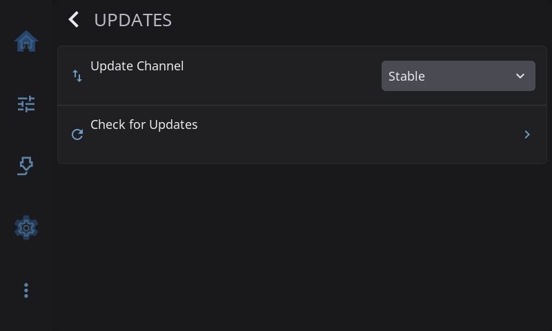

# Settings: Updates

**Settings > Updates** is where HelixScreen updates itself. The row on the Settings screen tells you where things stand: *Up to date*, the version that is waiting (for example *1.1.1 available*), *Checking…*, *Check failed*, or your installed version when it hasn't checked yet.

---

## Update Channel

| Channel | Description |
|---------|-------------|
| **Stable** | Recommended. Tested releases only. |
| **Beta** | Preview builds with new features. May have rough edges. |
| **Dev** | Development builds. Appears only with beta features enabled, and requires a `dev_url` set in `/var/lib/helixscreen/update_urls.json` (a root-owned file; see [CONFIGURATION](../../CONFIGURATION.md)). |

> **Note:** Selecting the **Dev** channel without a `dev_url` set in `update_urls.json` shows a "Dev channel requires dev_url in update_urls.json" message and won't check for updates. Dev builds are intended for HelixScreen contributors - most users should stay on **Stable** or **Beta**.

Changing the channel starts a fresh check on the new channel.

---

## Check for Updates

Tap **Check for Updates** to look for a newer release on your selected [update channel](#update-channel). If one is available, an update dialog walks you through installing it. You'll see the following stages:

1. **Update Available** — Shows the new version. Tap **Install** to begin, or **Cancel** to dismiss.
2. **Downloading...** — A progress bar tracks the download. You can still **Cancel** at this point. The dialog closes straight away, but the download itself keeps running quietly in the background until the current transfer finishes; the partly-downloaded file is then thrown away. If you start another update before that has happened, you'll get an **Update Failed** screen reading **"Previous download still finishing"** — wait a few seconds and tap **Retry**.
3. **Verifying...** — HelixScreen checks the downloaded file before installing.
4. **Installing...** — The new version is written into place. **Do not power off your printer** while this is in progress.
5. **Update installed!** — Confirmation that the new version is in place.
6. **Hang on, we'll be right back!** — HelixScreen restarts itself to run the new version.

Steps 5 and 6 are each shown only for a moment: the install is already finished by then, and the short pause exists so you can see that it succeeded before the app exits and comes back.

If something goes wrong, an **Update Failed** screen appears with a **Retry** button so you can try again, or **Close** to dismiss.

> **Caution:** Once installation begins, leave the printer powered on until HelixScreen restarts on its own. Interrupting an install can leave HelixScreen in an inconsistent state.

On Android, the install step opens the Play Store.

---

## Install Update

Appears once a check has found a version to install. Tap it to open the update dialog described above.

If you switched to a channel whose current release is older than the version you have (going from Beta back to Stable, for example), HelixScreen asks **Install Older Version?** first. Anything added since that version is removed.

---

## When updates come from somewhere else

Some installs can't update themselves, and the page says so instead of offering buttons that wouldn't work:

- **Software Updates: Managed by your firmware.** Your printer's firmware ships HelixScreen and updates it along with everything else. The channel, check and install rows are hidden, and the **Updates** row on the Settings screen reads *Managed by firmware*. Update the firmware to get a newer HelixScreen.
- **Software Updates: Not available here. Update from a terminal.** HelixScreen can see that a new version exists but can't write to its own install folder. Tap the row for a QR code that links to the instructions: you run the HelixScreen installer with `--update` from a terminal on the printer. See [Upgrading](../../UPGRADING.md) for the other ways to update.

---

[Back to Settings](../settings.md) | [Prev: System](system.md) | [Next: Help & About](help-about.md)
